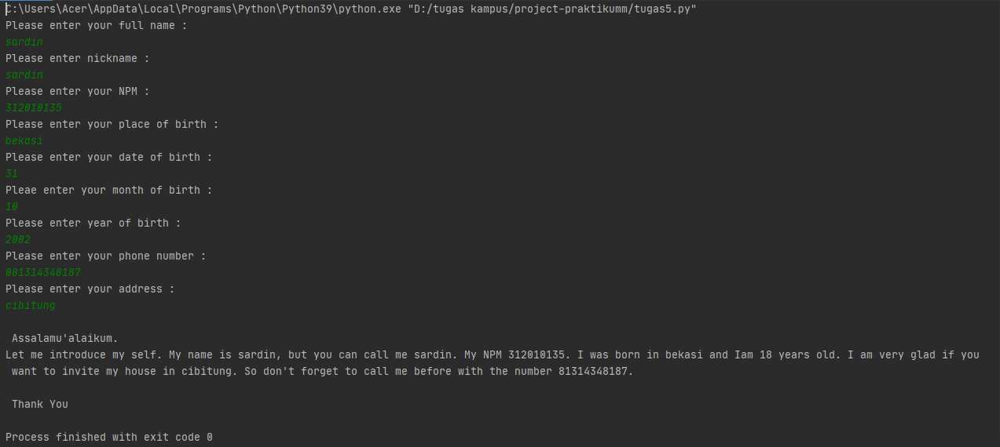
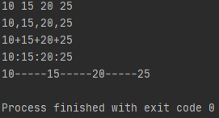
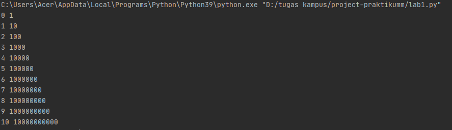
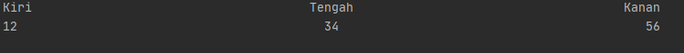
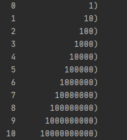
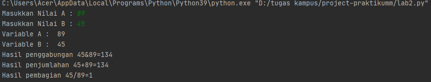

# project-pratikumm
## Dan Menjelaskan Project <br>

Nama : Sardin<br>
Nim : 312010135<br>
Kelas : TI.20.A.1<br>

## DAFTAR ISI  <br>

| NO | Description | Link |
| ----- | ----- | ---- |
| 1. | Pertemuan 5 - Latihan| [temukan](#pertemuan-5---latihan) |
| 2. | Pertemuan 6 - Lab 1 | [temukan](#pertemuan-6---lab-1) |
| 3. | Pertemuan 6 - Lab 1-2 | [temukan](#pertemuan-6---lab-1-2) |
| 4. | Pertemuan 6 - Lab 2 | [temukan](#pertemuan-6---lab-2) |
### Pertemuan 5 - Latihan


Pada pertemuan 5 bahasa pemograman, saya diberi soal untuk latihan oleh Dosen untuk membuat Aplikasi Biodata dengan python Seperti gambar dibawah <br>
.png) <br>
Saat ini saya akan menjelaskan hasil dari tugas tersebut. <br>
Berikut *Source code* nya atau klik link berikut ([latihan 5](tugas5.py)) : <br>
``` python
print("Please enter your full name : ")
fullname=input()
print("Please enter nickname : ")
nickname=input()
print("Please enter your NPM : ")
npm=int(input())
print("Please enter your place of birth : ")
pob=input()
print("Please enter your date of birth : ")
date=int(input())
print("Pleae enter your month of birth : ")
month=input()
print("Please enter year of birth : ")
year=int(input())
print("Please enter your phone number : ")
phone=int(input())
print("Please enter your address : ")
address=input()

dob=2020-year

print("\n Assalamu'alaikum. ")
print(f"Let me introduce my self. My name is {fullname}, but you can call me {nickname}. My NPM {npm}. I was born in {pob} and Iam {dob} years old. I am very glad if you want to invite my house in {address}. So don't forget to call me before with the number {phone}. \n Thank You ")
```
* Berikut penjelasannya <br>
```` python
print("Please enter your full name : ")
````
Source code diatas berfungsi untuk mencetak hasil / output berupa "**please enter your full name :**".<br>
Untuk menampilkan uotput string saya menggunakan *tanda petik dua* di dalam fungsi print(), sedangkan jika saya menampikan output/hasil berupa angka/interger saya tidak perlu menggunakan *tanda petik dua*. Contohnya :
``` python
print("Nama bapak adalah ...")
print(212)
```
<br>(seperti gambar dibawah ini)
<br>
<br>
* Untuk source code berikutnya adalah inputan atau membuat variable. Seperti syntax dibawah ini :
``` python
fullname=input()
```
Keterangan : <br>
1. Variable adalah sebuah wadah penyimpanan data pada program yang akan digunakan selama program itu berjalan. Yang berfungsi sebagai variable dalam source code diatas adalah **full name** . <br>
2. Fungsi **input()** adalah untuk memasukan nilai dari layar console di command prompt, lalu kemudian mengembalikan saat kita menekan tombol enter *(newline)* <br>
 <br>
Pada gambar diatas, hasil dari inputan berwarna *hijau* <br><br>
* Untuk memasukan perintah lain seperti *Nickname, NPM, Place Of Birth, Date of Birth, Year of Birth, Phone Number, and Address* mengikuti perintah yang sama seperti memasukkan *fullname*<br>
* Untuk menghitung rumus umur saya menggunakan variable *DOB* yaitu 2020 (Tahun Sekarang) dikurangi dengan Year of Birth, pada source code berikut :<br>

``` python
print("\n\n Assalamu'alaikum. ")
```
Pada syntax/source code diatas, saya menggunakan variable *dob* dimana untuk menghitung umur (variable **age** pada output), yaitu degan rumus pada variable *dob=2020-year*
<br>
* Langkah kali ini saya akan menampilkan output yang diminta oleh Dosen.<br>
Output pertama yang diminta Dosen adalah menampilkan salam, yaitu dengan mengetikkan syntax/source code berikut :
```` python
print("\n\n Assalamu'alaikum. ")
````
Keterangan :
1. Fungsi **\n** pada source code diatas adalah untuk memberi baris baru / enter / *(newline)*
2. Fungsi print() seperti dijelaskan pada poin **Outout** diatas
Hasil dari source code diatas adalah seperti gambar dibawah ini :<br>

``` python
print(f"Let me introduce my self. My name is {fullname}, but you can call me {nickname}. My NPM {npm}. I was born in {pob} and Iam {dob} years old. I am very glad if you want to invite my house in {address}. So don't forget to call me before with the number {phone}. \n\n Thank You ")
```
Keterangan :
1. Fungsi huruf **f** pada perintah *print(f"...")* adalah fungsi print atau bisa memudahkan programmer dalam mencetak statement dalam satu baris dibandingkan dengan metode yang lama yaitu memisahkan string dan variable dengan simbol koma ( , ) atau plus ( + )<br>
2. Sedangkan fungsi {} pada output tersebut adalah untuk menampilkan hasil dari variable<br>
Hasil dari output tersebut seperti berikut :<br>


<br>
<br>
<br>

## Pertemuan 6 - lab 1

Pada halaman ini (Tugas Pertemuan 6 - lab 1) saya diberikan tugas oleh Dosen yaitu mempelajari Operator Aritmatika menggunakan Bahasa Pemograman Python.Berikut source code yang diberikan oleh dosen [Source code lab 1](lab1.py) :
<br>
``` python
#Penggunaan End
print("A", end="")
print("B", end="")
print("C", end="")

print()
print("X")
print("Y")
print("Z")

#Penggunaan Separator
w,x,y,z=10,15,20,25
print(w,x,y,z)
print(w,x,y,z,sep=",")
print(w,x,y,z,sep="")
print(w,x,y,z,sep=":")
print(w,x,y,z,sep="-----")
```
Oke, kali ini saya akan menjelaskan tentang materi yang diberikan oleh Dosen.<br><br>

* pengguna END 
penggunaan end digunakan untuk menambahkan karakter yang dicetak di akhir baris. secara default penggunaan end adalah untuk ganti baris.  
``` python
print("A", end="")
print("B", end="")
print("C", end="")
```
> Penggunaan print() digunakan untuk mencetak output, seperti syntax dibawah ini :
``` python 
print()
```

> Syntax dibawah ini digunakan untuk menampilkan output berupa string
``` python
print("X")
print("Y")
print("Z")
```

Hasil dari source code tersebut seperti gambar dibawah ini :<br>


* Pengertian separaktor
sepaktor adalah pemisah yang berfungsi sebagai tanda pemisah antara objek yang dicetak. Defaultnya adalah tanda sepasi <br><br>

> Pndeklarasian beberapa variabel beserta nilainya 
``` python
w,x,y,z=10,15,20,25
```
> Menampilkan hasil setiap variabel tiap-tiap variabel 
``` python
print(w,x,y,z)
```
> Menampilkan hasil variable dari tiap-tiap variable menggunakan pemisah , (koma)
``` python
print(w,x,y,z,sep=",")
```
print(w,x,y,z)
```
> Menampilkan hasil variable dari tiap-tiap variable menggunakan pemisah , (koma)
``` python
print(w,x,y,z,sep=",")
> Menampilkan hasil variable dari tiap-tiap variable dengan menggunakan pemisah : (titik dua)
``` python
print(w,x,y,z,sep=":")
```
> Menampilkan hasil variable dari tiap-tiap variable dengan menggunakan pemisah ----
``` python
print(w,x,y,z,sep="-----")
```

Hasil dari syntax / source code diatas adalah seperti berikut ini: <br> 

<br>
<br>
<br>
### Pertemuan 6 - lab 1-2
* String format <br>
String formatting atau pemformatan string memungkinkan kita menyuntikkan item kedalam string daripada kita mencoba menggabungkan string menggunakan koma atau string concatenation.<br>

Penggunaan pada source yang di berikan Dosen sebagai berikut : <br>

print(1, 10 ** 1)
print(2, 10 ** 2)
print(3, 10 ** 3)
print(4, 10 ** 4)
print(5, 10 ** 5)
print(6, 10 ** 6)
print(7, 10 ** 7)
print(8, 10 ** 8)
print(9, 10 ** 9)
print(10, 10 ** 10)

# string format 2
print('{0:>3}{1:>16})'.format(0, 10 ** 0))
print('{0:>3}{1:>16})'.format(1, 10 ** 1))
print('{0:>3}{1:>16})'.format(2, 10 ** 2))
print('{0:>3}{1:>16})'.format(3, 10 ** 3))
print('{0:>3}{1:>16})'.format(4, 10 ** 4))
print('{0:>3}{1:>16})'.format(5, 10 ** 5))
print('{0:>3}{1:>16})'.format(6, 10 ** 6))
print('{0:>3}{1:>16})'.format(7, 10 ** 7))
print('{0:>3}{1:>16})'.format(8, 10 ** 8))
print('{0:>3}{1:>16})'.format(9, 10 ** 9))
print('{0:>3}{1:>16})'.format(10, 10 ** 10))
```
<br>
Saat ini saya akan menjelaskan satu persatu dari syntax yang diberikan oleh Dosen <br>
1. **String format 1** <br>
Pada syntax / source code string format 1 akan menampilkan output berupa 2 outputan. <br>
Yang pertama (sebelah kiri) akan menampilkan angka urut dari angka 0 hingga 10, sedangkan sebelah kanan akan menampilkan Oprasi Aritmatika Pangkat. <br>
Dengan ketentuan sebagau berikut, oprasi pangkat dengan angka kiri sebagai pokok (Rumus : ** [Bintang dua]) <br>
Hasil dari syntax tersebut adalah 10 pangkat 0, hingga 10 pangkat 10. Dengan output sebagai berikut : <br>


<br><br>

2. **String Format 2** <br><br>
Pada syntax / source code string format 2 akan menampilkan output berupa 2 output'an juga (Seoerti string format 1, yaitu kanan dan kiri) <br>
Dengan ketentuan sebagai berikut : <br>
> > Alignment, padding, dan precesion dengan **.format()** dalam kurung kurawal kita dapat menetapkan panjang bidang, rata kanan/kiri, parameter pembulatan dan banyak lagi. Contoh lain seperti berikut :
``` python
print('{0:8} | {1:9}'.format('ikan','Jumlah'))
print('{0:8} | {1:9}'.format('lele', 3.))
print('{0:8} | {1:9}'.format('gurame',1
```
Hasil dari source code contoh di atas akan seperti berikut : <br>


> Secara default, **.format()** menggunakan rata text kiri, angka ke kanan. <,^, atau > untuk perataan kiri, tengah , atau kanan. Contoh lain dari penggunaan **.format()** sebagai berikut : <br>
``` python
print('{:<30}{:^30}{:>30}'.format('Kiri','Tengah','Kanan'))
print('{:<30}{:^30}{:>30}'.format(12,34,56))
```
Hasil dari source code contohdiatas akan muncul seperti ini : <br>

<br>
<br>
Hasil string format 2 adalah : <br>
 
<br>
<br>

### Pertemuan 6 - lab 2

* Konversi Nilai Variable
Untuk pembahasan terakhir, kali ini akan myenyelesaikan tugas Lab 2 dari Dosen, yaitu Konversi Nilai Variable <br>
Tugas yang di berikan oleh Dosen adalah seperti gambar dibawah ini atau bisa di temukan dengan link berikut : ([temukan](lab%202.py))
``` python
a=int(input("Masukkan Nilai A : "))
b=int(input("Masukkan Nilai B : "))
print("Variable A : ",a)
print("Variable B : ",b)
print("Hasil penggabungan {1}&{0}=%d".format(a,b) %(a+b))

#Konversi nilai variable
a=int(a)
b=int(b)
print("Hasil penjumlahan {1}+{0}=%d".format(a,b) %(a+b))
print("Hasil pembagian {1}/{0}=%d".format(a,b) %(a/b))
```
<br>
Hasil dari source / code diatas : <br>


<br>
<br>

### TERIMAKASI <br>


